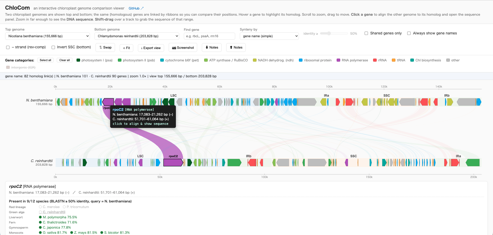

# ChloCom: An interactive chloroplast genome comparison viewer.

**An interactive chloroplast genome comparison viewer.**

ChloCom shows two chloroplast genomes stacked top and bottom and links homologous
genes with ribbons, so you can explore synteny, gene content, and sequence between
species right in the browser. It is a **single static web app** (HTML/CSS/JS): all
heavy analysis (gene extraction, IR detection, BLAST) is precomputed offline, so the
page runs with no server — open `index.html` locally or host it on GitHub Pages.



## Features

- **Two-genome comparison** — pick any top/bottom pair from 12 built-in genomes; homologous genes are joined by colored ribbons.
- **Two synteny modes** — *gene name* (match by annotation) or **BLASTN** (precomputed per-gene blastn) with a **live % identity threshold** slider.
- **Gene info panel** — click a gene to see its category, position/strand in both genomes, homolog (and % identity in BLASTN mode), plus a **cross-species presence list** across all 12 species, arranged as a phylogeny-style tree (BLASTN-based, threshold-driven).
- **Sequence** — zoom in to read the DNA letters; extract any range (Shift-drag or start+length) or a gene as **FASTA / copy**; toggle reverse-complement.
- **Genome structure** — regions colored as **LSC / IRa / SSC / IRb** (IR detected by self-blast, coordinates rotated so each genome starts at its LSC); IR genes mirrored into both copies; optional **SSC inversion** (flip-flop isomer); **intergenic regions** with their own homology.
- **Notes** — leave a note on any gene (saved in the browser's localStorage; export/import as JSON).
- **Export** — save a PNG screenshot of the current view.
- **Self-contained** — data is embedded as JS, so it works from `file://` (double-click) and on GitHub Pages alike.

## Built-in genomes (12)

| Species | Common name | Accession | Length |
|---|---|---|---|
| *Nicotiana benthamiana* | benthamiana tobacco | cultivar LAB (Guo L., assembly) | 155,666 bp |
| *Manihot esculenta* | cassava | NC_010433.1 | 161,453 bp |
| *Arabidopsis thaliana* | thale cress | NC_000932.1 | 154,478 bp |
| *Oryza sativa* | rice | NC_001320.1 | 134,525 bp |
| *Zea mays* | maize | NC_001666.2 | 140,384 bp |
| *Sorghum bicolor* | sorghum | NC_008602.1 | 140,754 bp |
| *Cryptomeria japonica* | sugi (Japanese cedar) | NC_010548.1 | 131,810 bp |
| *Ceratopteris thalictroides* | water fern | NC_062137.1 | 149,399 bp |
| *Marchantia polymorpha* | liverwort | NC_037507.1 | 120,304 bp |
| *Chlamydomonas reinhardtii* | green alga | NC_005353.1 | 203,828 bp |
| *Cyanidioschyzon merolae* | red alga | NC_004799.1 | 149,987 bp |
| *Phaeodactylum tricornutum* | diatom | NC_008588.1 | 117,369 bp |

## Usage

No build step. **Open `index.html` in a browser** (or visit the hosted page).

- **Top / Bottom genome** — choose the two genomes to compare. **⇅ Swap** flips them.
- **Hover a gene** — highlights its homolog; tooltip shows positions (and % identity in BLASTN mode).
- **Click a gene** — pins it, scrolls the other genome so its homolog lines up, and opens the gene-info and sequence panels. **Click empty space** to clear.
- **Synteny by** — `gene name` or `BLASTN`. **identity ≥** slider sets the BLASTN homology threshold (controls ribbons in BLASTN mode and the per-species presence list at all times). The lower bound equals the floor used when precomputing BLAST.
- **Scroll** to zoom (the base under the cursor stays fixed), **drag** to pan, **⟲ Fit** to reset. Zoom in far enough and **DNA letters** appear.
- **Shift-drag** a track, or use the **Extract sequence** panel (Start + Length), then **Copy / Download FASTA**. **⤓ Export view** saves the visible range of both genomes.
- **Gene categories** legend (above the tracks) — click to show/hide categories; **Select all / Clear all**. Includes PSI / PSII / cyt b6f / ATP-RuBisCO / ndh / ribosomal / RNA polymerase / rRNA / tRNA / Chl biosynthesis / other / intergenic (IGR, off by default).
- **− strand (rev-comp)**, **Invert SSC (bottom)**, **📷 Screenshot**, **⬇/⬆ Notes** (export/import).

## How it works

Two stages:

1. **Offline (Python, once)** — `generate_data.py` reads GenBank files, detects the IR by
   self-blastn, rotates to LSC-first, extracts genes / intergenic regions, classifies them,
   and runs **per-gene blastn for every ordered genome pair**. It writes plain JavaScript
   data files (`data/genomes.js`, `data/sequences.js`, `data/blast.js`) that just assign to
   `window.*` globals.
2. **In the browser (JavaScript)** — `app.js` reads those globals and draws everything as
   **SVG** (genome tracks, gene arrows, ribbons, base letters), handling zoom/pan/hover/click.
   No backend, no live BLAST — the threshold slider just filters the precomputed hits.

This is why it runs from `file://` and on static hosting with no server.

## Regenerating / adding a genome

```bash
python3 generate_data.py        # rebuilds data/*.js from the gb files in gb/
```

To add a species, add one line to the `GENOMES` list in `generate_data.py`
(`(label, display_name, gb_filename, accession)`) and re-run. **If the gb file is not in
`gb/`, it is downloaded automatically from the accession** (NCBI accessions only; a gb with
no accession must be placed in `gb/` manually). New genomes appear in the dropdowns automatically.

Requirements (only for regenerating data): Python 3, [Biopython](https://biopython.org/),
and [NCBI BLAST+](https://blast.ncbi.nlm.nih.gov/) (`makeblastdb`, `blastn`), plus
[NCBI EDirect](https://www.ncbi.nlm.nih.gov/books/NBK179288/) (`efetch`) for auto-download.

## Repository layout

```
index.html          page + controls
style.css           styles
app.js              SVG rendering, zoom/pan, homology links, sequence, notes, screenshot
data/genomes.js     gene/region annotations          (window.GENOME_DATA / GENOME_INDEX)
data/sequences.js   rotated genome sequences          (window.GENOME_SEQ)
data/blast.js       per-gene blastn hits + threshold  (window.GENOME_BLAST / _META)
gb/                 source GenBank files (input to generate_data.py; not needed at runtime)
generate_data.py    builds the data/*.js files
docs/screenshot.png README image
```

## Data sources & notes

- Chloroplast sequences are NCBI RefSeq (accessions above); *N. benthamiana* uses a
  cultivar-LAB complete-plastome assembly (Guo L., unpublished) provided locally.
- Homology in BLASTN mode is **nucleotide** identity (blastn); divergent pairs therefore
  show lower % than a protein-level comparison would.
- Gene-content calls depend on each genome's annotation; naming differences can affect the
  gene-name mode and the presence list.

*ChloCom — built for comparative chloroplast genomics.*
